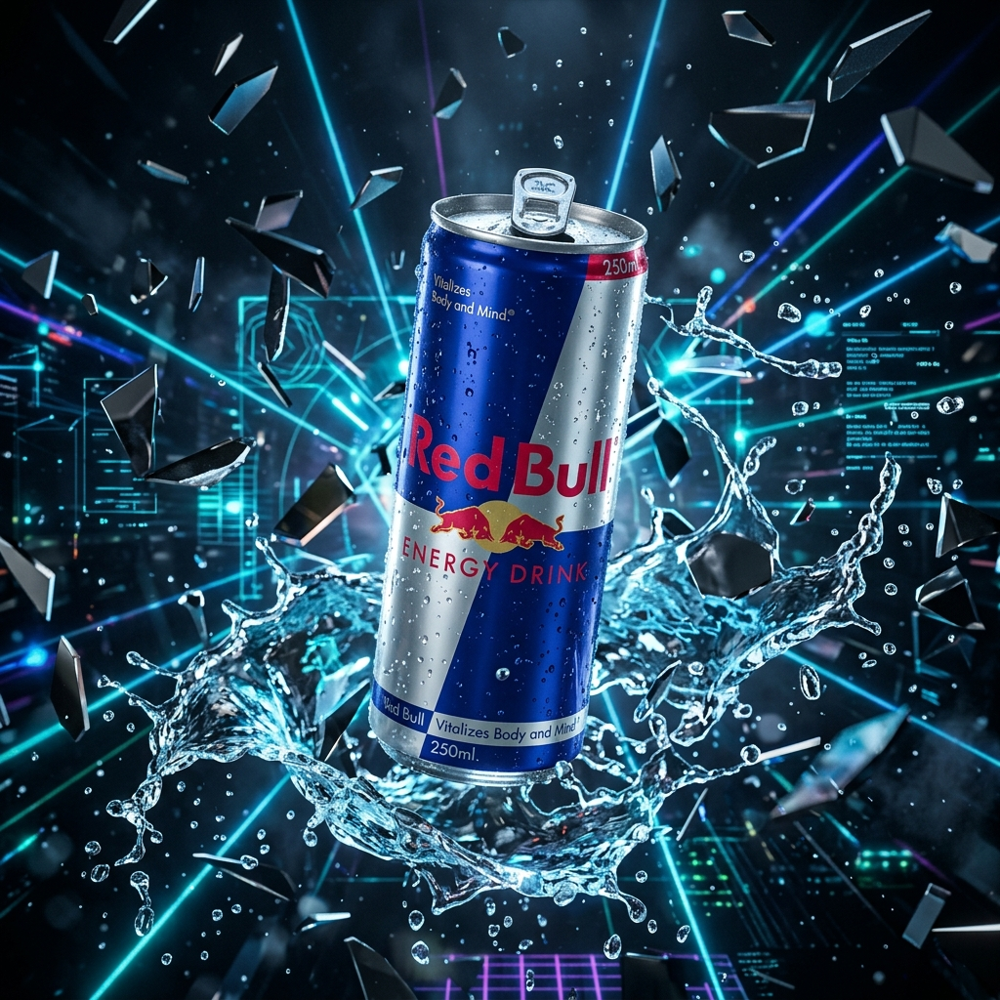
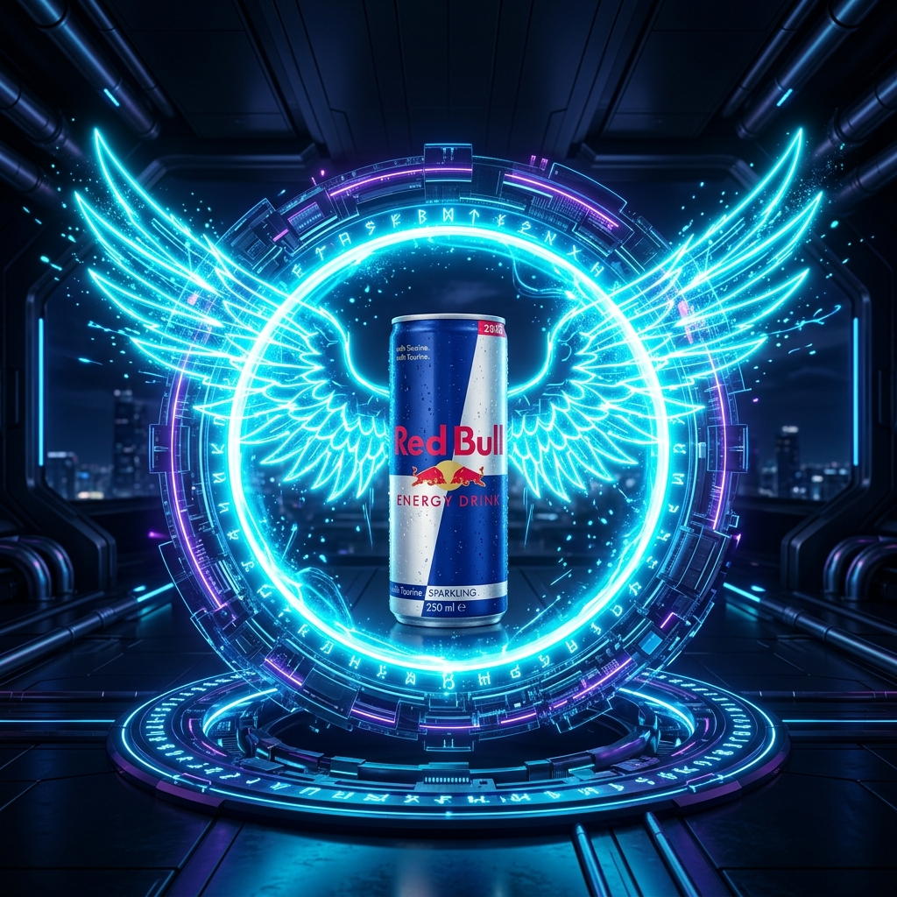
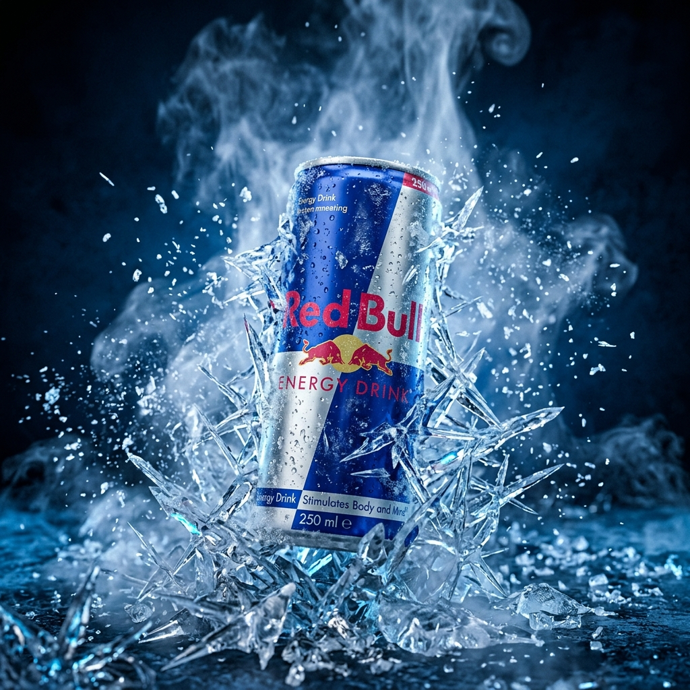

# Red Bull Cinematic Digital Experience ⚡
Prievew - https://redbull-experience-blush.vercel.app/
A premium, high-impact interactive landing page inspired by Red Bull and built with Apple-style scroll storytelling, immersive 3D-style animations, and realistic ambient lighting.

Designed and built using **Next.js (App Router)**, **Tailwind CSS v4**, **GSAP**, and **Framer Motion**.

---

## 🎨 Professional 3D Renders Showcase

We've integrated a set of high-fidelity, custom-rendered 3D assets to create a luxury product showcase on scroll:

<p align="center">
  
  
  
</p>

---

## ✨ Immersive Features

*   🎥 **Kinetic Video Background**: Embedded a high-performance looping abstract blue energy wave video inside the hero section, masked with a deep dark blue gradient overlay to ensure content legibility.
*   🔄 **Scroll-Linked Product Evolution**: Driven by **GSAP ScrollTrigger**, the main product visual evolves dynamically as the user scrolls, transitioning opacities and scales across four distinct stages:
    1.  **Classic Can** (Caffeine slide)
    2.  **Fluid Splash & Shards** (Taurine slide)
    3.  **Cryo Frost Blast** (B-Vitamins slide)
    4.  **Cyber Wings Portal** (Alpine Water slide)
*   💎 **Interactive Can Anatomy**: Pulsing HUD hotspots mapped across the product shell. Click or hover on the coordinates to dissect the pull tab, double-seam seal, recyclability footprint, and matte-grip texture details.
*   🌈 **Ambient Flavor Showroom**: A premium slider showcasing Classic, Sugarfree, and Tropical editions. Selecting different editions triggers fluid can transitions and morphs the background's ambient glow.
*   🚀 **Tactile Inertia Cursor**: Dual-layered custom cursor featuring magnetic tracking, interactive states (scaling/color morphing on link hovers), and smooth inertia.
*   💧 **Lenis Smooth Scroll**: Buttery smooth client-side kinetic scrolling fully synchronized with GSAP ScrollTrigger timelines.

---

## 🛠️ Technology Stack

*   **Framework**: Next.js 16 (App Router)
*   **Styling**: Tailwind CSS v4 (native `@theme` config, CSS variables)
*   **Animation**: GSAP (ScrollTrigger) & Framer Motion
*   **Smooth Scroll**: Lenis
*   **Iconography**: Lucide React
*   **Language**: TypeScript

---

## 🚀 Getting Started

### 1. Clone the project
```bash
git clone https://github.com/neerajcoder1/redbull-experience.git
cd redbull-experience
```

### 2. Install dependencies
```bash
npm install
```

### 3. Run the development server
```bash
npm run dev
```

Open [http://localhost:3000](http://localhost:3000) with your browser to see the result.

### 4. Build for Production
```bash
npm run build
```

---

## 📄 License
This project is for creative portfolio purposes. All brand names, logos, and assets remain the property of their respective owners.
